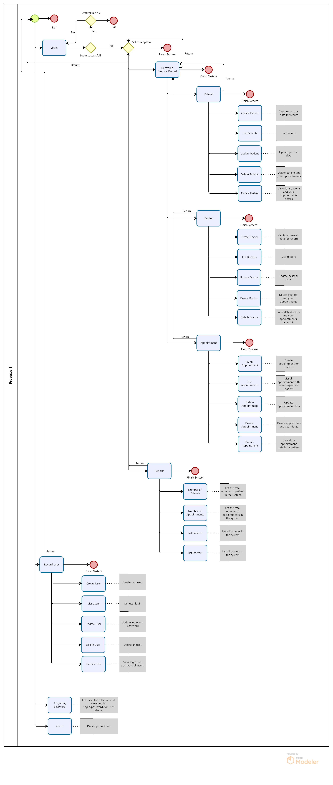

## Project EMR - Electronic Medical Record

## 🗃️&nbsp; Table of Contents

* [About the project](#about-project)
* [Class diagram](#class-diagram)
* [Application flowchart](#application-flowchart)
* [Application in operation](#application-operation)
* [Instructions for execute the Project](#execute-project)
* [Technologies and Concepts](#technologies)  
* [Authors](#authors)

 

---

## 🏥&nbsp; About the project 

It is a system used to manage the attendance of a clinic. It has functionalities to manage patients with their respective medical records, which in turn store their medical consultation.

 

---

## 📈&nbsp;Class Diagram 
 

 

----
## 🔀&nbsp; Application flowchart 

The system flow is based on the concept:
- Patient ➡️ Medical Record ➡️ medical consultation 

    
<b>👈🏽 &nbsp; Click here to expand the flowchart </b>

 

----

## ▶️&nbsp; Application in operation 

  | Functionality  | View Here |
  |------|---------|
  |🏥&nbsp; Menu Principal|[
▶️
](./readmes/main.md)|
  |👨🏻‍💻&nbsp; User CRUD|[
▶️
](./readmes/user.md)
  |😷&nbsp; Patient CRUD|[
▶️
](./readmes/patient.md)
  |👩‍🔬&nbsp; Doctor CRUD|[
▶️
](./readmes/doctor.md)
  |🩺&nbsp; Appointment CRUD|[
▶️
](./readmes/appointment.md)
  |📊&nbsp; Reports|[
▶️
](./readmes/reports.md)
   

## 👨🏽‍🏫&nbsp; Instructions for execute the Project 

1. Make a project copy to your machine:
    - git clone https://github.com/seiler-emerson/Entra21_Project_EMR_2022.git
    - Or a direct download from the page [HERE](https://github.com/seiler-emerson/Entra21_Project_EMR_2022).
    - Import the project into your IDE and execute the application.
        - Tutorial how to import a project in the Eclipse IDE [HERE](https://www.youtube.com/watch?v=R-8OF9ipeT8).
2. Run with REPLIT
    - (Not implemented))

 

---

## 📚&nbsp; Technologies and Concepts 

In this project we use JAVA language and apply the following concepts:

	
  
<b>💡&nbsp; Programming logic</b>

1. Git
    - Repository
    - Documentation
    - README.md
    - Replit
2. Project organization
    - Packages / sub-packages
    - Nomenclature
3. Basic elements
    - variables
    - constants
    - comments
4. Decision structures
    - if, else-if, else
    - switch
5. Repeat loops
    - for
    - while
    - do-while
6. Modularization
    - methods with or without parameters and with or without returns
    - recursion

	
  
<b>🗃️&nbsp; Object Oriented Programming</b>

  
1. Classes
    - class diagram
    - attributes
    - builders
    - encapsulation
    - specific methods
    - instantiate objects
2. Heritage
    - extends
    - create new constructors based on the super class
    - Polymorphism
        - Just take advantage of the methods
        - Do it completely specifically
        - Overwrite to:
            - Do it specifically
            - Take advantage of the behavior and make a complement
3. Polymorphism
    - interfaces

   
<b>⚠️&nbsp; Advanced java</b>

1. Classes wrapper
2. ENUM
3. Annotations
4. Collections
    - ArrayList
    - LinkedList
    - HashSet
    - HashMap
5. Lambda functions
6. Generics
7. Dates
8. Exceptions

 

---

## 👨🏻‍🎓👩‍🎓👨🏼‍🎓&nbsp; Authors 

 

<table>
<thead>
	<tr>
	    <th>
            
        </th>
		<th>
            
        </th>
		<th>
            
        </th>
	</tr>
</thead>
<tbody>
	<tr>
        <td>
            
        </td>
		<td>
            
        </td>
		<td>
            
        </td>
	</tr>
</tbody>
</table>

 

---

